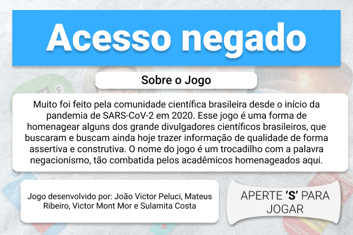

<h1>
Access Denied
</h1>

<h2>
How to run the game?
</h2>
<h3>
Installing packages
</h3>

> sudo apt update

> sudo apt-get install g++

> sudo apt-get install libsdl1.2-dev libsdl-image1.2-dev libsdl-mixer1.2-dev libsdl-ttf2.0-dev

<h3>
Compiling
</h3>

> g++ -o jogo jogo.cpp -lSDL -lGL -lSDLmain -lSDL_image -lSDL_mixer

<h3>
Running
</h3>

> ./jogo

Have fun!

<h2>
About the game
</h2>

The name given is a pun with scientific denialism, and so it's called "Acesso Negado" ("Access Denied", in english). The main characters Atila Iamarino, biologist and professor at UNICAMP, Natalia Pasternak - researcher of ICB-USB and PhD, Vitor Mori - member of the group COVID-19 observatory and researcher of Vermont University, and the researcher and science popularizer Luiza Caires from USP Journal, should fight against some recurrent figures of the present, as medications that are used as treatments for COVID-19, even without the due comprovation, the conspiracy image of the Flat Earth and the major one: the Fake News.

Gameplay: https://youtu.be/E_RJm8jiX_Y

<h3>Images</h3>

<h3>
Features
</h3>

<ul>
<li> Custom background (but not animated)</li>
<li>Enemies with different textures, randomized (but with same behavior)</li>
<li>Lives</li>
<li>Music (Soundtrack)</li>
<li>Different Screens</li>
<li>Difficulty Selector</li>
<li>Character Selector</li>
</ul>

<h2>How to play</h2>

Press <strong>'S'</strong> to start the game or <strong>'O'</strong> to go to options.  

<h3>'O' Options</h3>
Select which character do you want to play with, using keys from <strong>'1' to '4'</strong>. You can also press <strong>'L'</strong> and see more information about the game.

<h3>'S' Start</h3>
The game starts with difficulty '1', in which the enemies try to shoot you small "coronaviruses" and the researcher should try to dodge using the arrow keys <strong>(←, →, ↑, ↓)</strong>. Pressing <strong>'space'</strong> key, the character shoots vaccines onto the enemies. Pressing any key from <strong>'1'</strong> to <strong>'5'</strong>, the difficulty changes and the enemies start to shoot more frequently. 

While the game is running, you can press <strong>'P'</strong> to pause. Press <strong>'S'</strong> to resume.

You have 3 lives, when you lose them all, you lose the game and the "Game Over" screen is shown.
If you eliminate all the 33 enemies, you win the game and the "Victory" screen is shown.

